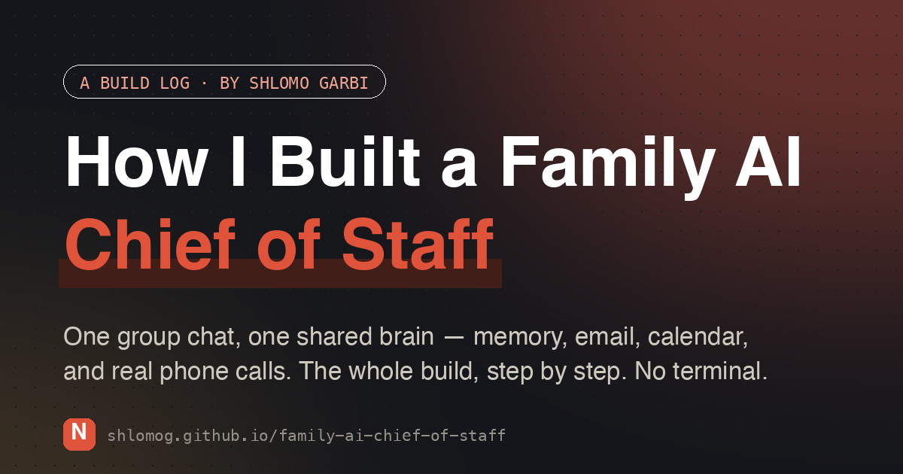

# How I Built a Family AI Chief of Staff

**Read the guide → [shlomog.github.io/family-ai-chief-of-staff](https://shlomog.github.io/family-ai-chief-of-staff/)**

It picks up the phone and books a table in a real voice — but the party tricks aren't the
point. The point is that it runs our whole household from our family group chat: my partner
and I both hand it the week, and one shared brain keeps everything straight.

This is the complete build log — from an empty machine to a working family chief of staff —
using [NanoClaw](https://github.com/qwibitai/nanoclaw) and
[Claude Code](https://claude.ai/download). Every step is broken down to the smallest action,
and you never open a terminal: you just talk, in plain English, to two things — Claude Code
(to build) and your assistant (to set how it behaves).

**What's covered:** secure install · wiki memory · WhatsApp (and moving the family in) ·
Gmail · Calendar · proactive recipes (morning brief, nag-list, date night, dinners, the
summer-vacation project) · outbound phone calls · privacy posture.

Prefer Markdown? The same guide: [nano-chief-of-staff.md](nano-chief-of-staff.md)

---

Built & written by [Shlomo Garbi](https://www.linkedin.com/in/shlomog/) — say hi on LinkedIn.
All names, numbers, and personal details in the story are placeholders.
